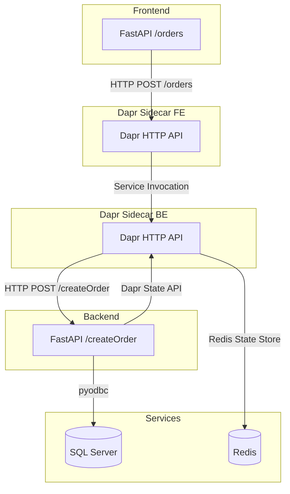

# Container Apps Demo (Dapr, FastAPI, SQL Server, Redis)

## Architecture



## Local Development

### Prerequisites

- Docker & Docker Compose
- Dapr CLI
- Python 3.11
- ODBC Driver 17 for SQL Server (for backend)
- SQL Server & Redis (see docker-compose.yml)

### Setup

1. **Start SQL Server and Redis:**
   ```sh
   docker-compose up -d
   ```

2. **Initialize SQL Table:**
   ```sh
   sqlcmd -S localhost,1433 -U sa -P YourStrong!Passw0rd -i sql/init.sql
   ```

3. **Install Python dependencies:**
   ```sh
   pip install fastapi uvicorn httpx pyodbc
   ```

4. **Run Backend with Dapr:**
   ```sh
   dapr run --app-id backend --app-port 4000 --app-protocol http --dapr-http-port 3501 --components-path ./components -- uvicorn backend.app:app --host 0.0.0.0 --port 4000
   ```

5. **Run Frontend with Dapr:**
   ```sh
   dapr run --app-id frontend --app-port 3000 --app-protocol http --dapr-http-port 3500 --components-path ./components -- uvicorn frontend.app:app --host 0.0.0.0 --port 3000
   ```

### Testing

#### 1. Create an Order

```sh
curl -X POST http://localhost:3000/orders -H "Content-Type: application/json" -d '{"item":"test"}'
```

#### 2. Verify SQL Server

```sh
sqlcmd -S localhost,1433 -U sa -P YourStrong!Passw0rd -Q "SELECT * FROM orders.dbo.Orders"
```

#### 3. Verify Redis

```sh
redis-cli GET order-<id>
```
Replace `<id>` with the order ID returned from the create order response.

---

## Notes

- Both frontend and backend are implemented in Python using FastAPI.
- Dapr handles service invocation and state management.
- SQL Server stores order records; Redis caches order data via Dapr state store.